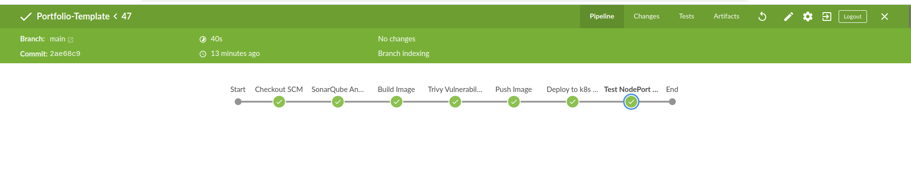

<h1>📦 Portfolio-Template</h1>

This project showcases a complete CI/CD pipeline for deploying a portfolio web application, integrating code quality analysis, security scanning, containerization, and automated deployment into a Kubernetes environment.

<h2>🚀 Tools and Technologies Used</h2>
<ul>
    <li><strong>Jenkins</strong> — Orchestrates the CI/CD workflow through multiple stages.</li>
    <li><strong>Docker</strong> — Builds and manages container images for the application.</li>
    <li><strong>Kubernetes (Minikube)</strong> — Provides a local Kubernetes cluster for deployment testing.</li>
    <li><strong>ArgoCD</strong> — Manages continuous deployment with GitOps methodology.</li>
    <li><strong>SonarQube</strong> — Analyzes code quality and reports issues and vulnerabilities.</li>
    <li><strong>Trivy</strong> — Scans Docker images for vulnerabilities and generates security reports.</li>
</ul>

<h2>🛠️ Pipeline Workflow</h2>
<ol>
    <li>Clone the source code from GitHub.</li>
    <li>Analyze the codebase using SonarQube to identify bugs, vulnerabilities, and code smells.</li>
    <li>Build a Docker image from the Portfolio-Template directory.</li>
    <li>Scan the built Docker image using Trivy to detect vulnerabilities at different severity levels.</li>
    <li>Push the Docker image to DockerHub using Jenkins credentials.</li>
    <li>Deploy the application to a Minikube Kubernetes cluster by updating and applying Kubernetes manifests.</li>
    <li>Test the application's availability through a NodePort service.</li>
    <li>Publish detailed security reports (HTML and XML formats) into Jenkins for analysis and review.</li>
</ol>

<h2>📸 Pipeline Success Snapshot</h2>

Below is a snapshot showing the successful execution of the pipeline:

<h2>📋 How to Run Locally</h2>
<ol>
    <li>Clone this repository to your local machine.</li>
    <li>Ensure Jenkins is installed and configured with the necessary plugins (Docker, Kubernetes CLI, SonarQube, Trivy).</li>
    <li>Install and start a local Minikube cluster.</li>
    <li>Configure SonarQube server and scanner in Jenkins.</li>
    <li>Set up DockerHub credentials in Jenkins for image push operations.</li>
    <li>Install ArgoCD and connect it to your GitHub repository (optional for GitOps CD).</li>
    <li>Trigger the Jenkins pipeline and monitor the stages through the Jenkins dashboard.</li>
</ol>

<h2>✨ Key Features</h2>
<ul>
    <li>Code quality checks enforced through SonarQube.</li>
    <li>Automated container security scanning using Trivy.</li>
    <li>Continuous integration and deployment with Jenkins and Kubernetes.</li>
    <li>Detailed security reports generated and published automatically.</li>
    <li>GitOps-driven deployment with ArgoCD for automated syncing and rollback.</li>
</ul>
